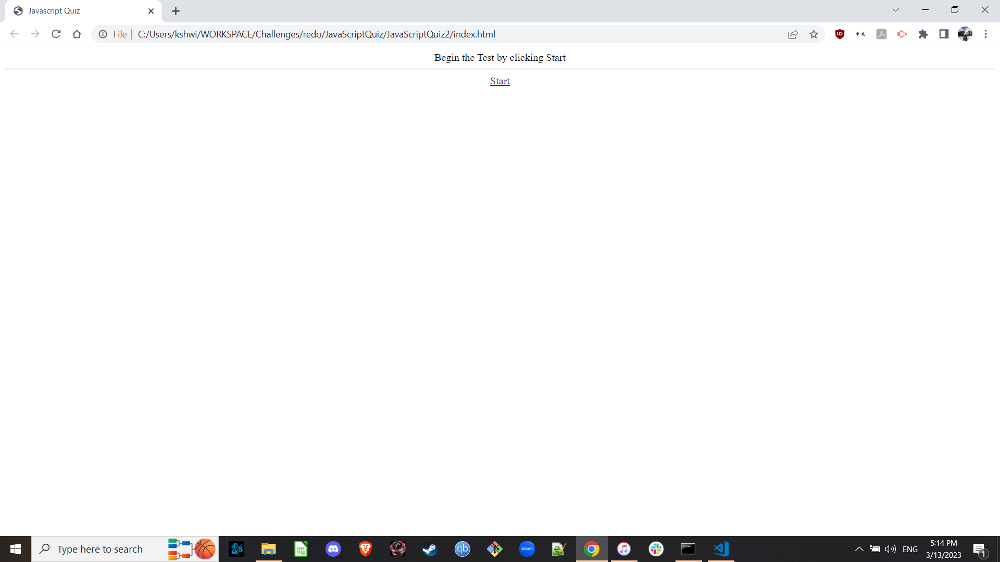

# JavaScriptQuiz2

2nd attempt at creating a JS Quiz
I reorganized the layout so that the questions only show up as you answer them one at a time.
The high scores list still doesn't function, I'm curious how to make it work.

